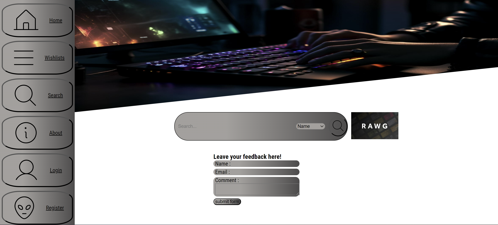

README:

Inleiding:
Dit project is gemaakt als onderdeel van de bootcamp fullstack developer via de NOVI Hogeschool.
Deze opdracht maakt deel uit van de frontend leerlijn. Dit wilt zeggen dat bij dit onderdeel geen backend gebruikt is op de
educational backend van NOVI na.

Applicatie starten:
Om aan deze opdracht te kunnen werken zal deze naar Webstorm of een andere IDE gecloned moeten worden. Hieronder zal ik stapsgewijs uitleggen hoe dit dient te gebeuren.
Het clonen van het project gebeurd via de SSH key die je vanuit github kunt halen.
Importeer deze in github via de git sectie (in webstorm onder het hamburgermenu).

Zodra je dit gedaan hebt komt het volgende gedeelte aan de beurt, namelijk alle packages installeren die gebruikt zijn binnen het project. Deze staan normaal
gesproken onder het kopje node_modules in je project, maar moeten altijd even binnen gehaald worden als je een project start.
Hou er rekening mee dat dit tot ongeveer 1 a 2 minuten kan duren afhankelijk van de snelheid van je computer en de snelheid van je internetvberbinding.

Het installeren van deze packages en alle dependencies die daarmee verbonden zijn gebeurd via het commando:

npm install

Indien je aanpassingen wilt maken in de code voor je eigen project is het volgende van belang:
Vergeet niet om voordat je eventueel aanpassingen gaat maken aan de code je in de terminal de code "git remote remove origin" plaatst.
Zo ontkoppel je het project van de huidige repositroy en kan je deze aan je eigen koppelen. Hoe je dit doet zal ik hieronder kort behandelen.

- Ga naar github.com
- Ga naar new
- Kies een nieuwe naam voor je repository
- Zorg ervoor dat de repo op public staat;
- Zet de repositroy op SSH (of hou deze daarop als dit al het geval is)
- Ga vervolgens naar "push an existing repository from the command line"
- voeg de 3 regels per regel toe. Als het goed is krijg je vervolgens een succesmelding.

Zodra dit gebeurd is kan je aan de slag. Via het commando npm run dev kun je een soort preview van de website van de website bekijken.
Je krijgt vervolgens een local host url te zien in de terminal waarmee je deze kunt openen. Dit is een erg handigh onderdeel voor tijdens het programmeren.
Ik raad altijd aan om deze erbij te houden bij het programmeren zodat je live kunt zien wat er gebeurd terwijl je aan het coderen bent.

De meeste onderdelen van deze applicatie staan binnen componenten. Sommige componenten zijn dynamisch en krijgen via iets wat we "props" noemen informatie binnen waar het component
vervolgens toegang tot heeft. En soms zijn het statische compomnenten die puur een functie uitvoeren voor een specifieke pagina.

API

Binnen dit project wordt daarnaast ook gebruik gemaakt van een API. De toegang tot die API wordt geregeld via een API key.
De key staat in het .env bestand en kan 20.000 keer per maand gratis gebruikt worden. Deze key wordt automatisch doorgegeven aan de API,
maar zal in dit project ook nog onderaan deze pagina bijgevoegd worden. Bij wijzigingen in het project raad ik aan om altijd even een build commando van
npm uit te voeren, dit kan door in de terminal het volgende in te voeren:

npm run build

Ik zou dit commando ook invoeren na het installeren van het project. Dit creërt namelijk een geoptimaliseerde build van je project. 

Andere handige NPM commando's zijn:
- npm init, voor het initialiseren en het creëren van een package.json file
- npm version, om te kijken naar de versie van node die je geinstalleerd hebt.
- npm install -g, voor het updaten van npm
- npm help, voor hulp met npm gerelateerde zaken.

Nog één belangrijk onderdeel betreft het gebruik van de letter q. Als je eenmaal npm run of npm run dev gebruikt hebt en je wilt iets in de terminal doen kan dit alleen als je
in de terminal klikt en op q drukt. Wil je daarna weer npm runnen moet je het commando hiervoor weer gebruiken.

De API heeft altijd een key nodig nodig in het verzoek, de request, om gegevens terug te kunnen krijgen zodat alleen de juiste mensen
toegang hebben tot de gegevens van de API. In het geval van dit project is dat:

Key :  cfbdc29c24df4c6ead2de38a04292a7e

Als het goed is werkt deze code al, deze zit namelijk in het .env bestand. Mocht dit niet het geval zijn is het het makkelijkste om ter hoogte
van de source map 2 bestanden aan te maken, een .env file waar je:

VITE_REACT_API_KEY=cfbdc29c24df4c6ead2de38a04292a7e

in plaatst en een .env.dist bestand waar je de volgende code in plaatst zonder key:
VITE_REACT_API_KEY=

Sommige pagina's binnen de website kunnen alleen bereikt worden indien je ingelogd bent op de pagina.
Hiervoor navigeer je via de linkerzijde van de pagina naar de registratie button.
Na registratie dien je naar de inlogpagina te gaan via dezelfde knop aan de linkerzijde van de pagina.
Eenmaal ingelogd met de gegevens wordt je vanzelf doorgestuurd naar de profielpagina waar je eventueel gegevens aan kunt passen
of een foto toe kunt voegen. Vanaf dit moment heb je toegang tot alle functionaliteiten binnen de website.

Overige informatie:
alleen de detail pagina van de games en de specifieke wishlist pagina zijn alleen te bereiken via respectievelijk
de wishlist overview of search resultpagina. De game detail pagina kan zowel bereikt worden via de specifieke wishlist als wel de search
overzicht pagina.

Na het registreren word je wachtwoord en username nergens opgeslagen, onthou deze goed!
Registreren kan binnen enkele seconde op de registratiepagina.

Link Github repository: https://github.com/MelroyL92/final-assignment

Happy coding!

